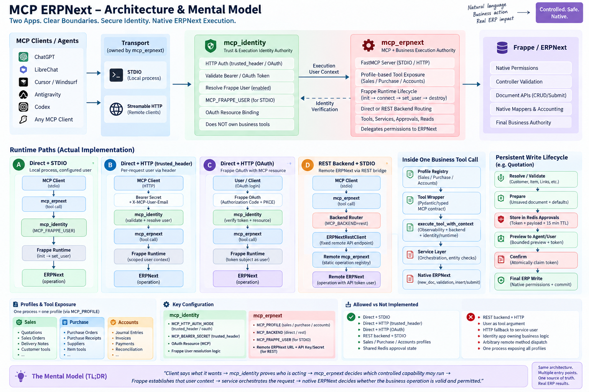

# ERPNext MCP Server

## Architecture & Mental Model



`mcp_erpnext` is one local ERPNext MCP app with explicit profile-specific server
inventories. It exposes a small, controlled
set of reusable ERPNext capabilities; it is not a generic ERPNext, Frappe, SQL,
or arbitrary-DocType CRUD interface.

The server supports local STDIO and an explicitly configured Streamable HTTP
bridge. Set `MCP_PROFILE=sales` (the backwards-compatible default) or
`MCP_PROFILE=purchase`; both transports apply the same profile selection:

```text
MCP Client / Agent
        |
        v
MCP transport
        |
        v
Domain MCP tools
        |
        v
ERPNext services
        |
        v
Frappe runtime and permissions
        |
        v
ERPNext
```

## Current profiles

One app exposes independent domain MCP instances:

```text
MCP_PROFILE=sales                  MCP_PROFILE=purchase
|                                  |
|-- Customer / Item masters        |-- Supplier / purchase Item resolution
`-- Quotation / Sales Order        `-- Purchase Order
```

Sales preserves its existing Customer and sales-Item capabilities. Purchase
uses the same resolver and runtime infrastructure but exposes Supplier and
purchase-enabled Item resolution plus the Purchase Order flow. No profile
exposes the other profile's transactional tools.

The Sales profile tools are:

```text
search_customers
resolve_customer
prepare_customer
confirm_customer

search_items
resolve_item
prepare_item
confirm_item

prepare_sales_order
confirm_sales_order

prepare_quotation
confirm_quotation
```

The Purchase profile tools are:

```text
search_suppliers
resolve_supplier
search_items
resolve_item
prepare_purchase_order
confirm_purchase_order
```

The current architecture, [public tool contract standard](docs/architecture/MCP_TOOL_CONTRACT_STANDARD.md),
[conversational interaction contract](docs/architecture/MCP_CONVERSATIONAL_INTERACTION_CONTRACT.md),
and generated [complete tool catalog](docs/TOOLS.md) document this boundary.
The original, narrower Sales Order baseline is preserved in
[`docs/MCP_SALES_ORDER_V1_FROZEN.md`](docs/MCP_SALES_ORDER_V1_FROZEN.md).
See [`docs/MCP_PROFILES.md`](docs/MCP_PROFILES.md) for exact stdio and
Streamable HTTP startup commands plus the two LibreChat entries.

For direct manual HTTP testing, see the [Postman MCP HTTP testing guide](docs/testing/POSTMAN_MCP_HTTP_TESTING.md)
and the [human-readable Hinglish system guide](docs/guides/MCP_SYSTEM_HUMAN_GUIDE_HINGLISH.md).

## Safe persistent writes

Search and resolution tools locate records that the configured Frappe user may
read and do not persist data. Creation follows a shared two-phase boundary:

```text
resolve / validate
        |
        v
prepare
        |
        v
preview
        |
        v
explicit approval
        |
        v
confirm
        |
        v
ERPNext write
```

`prepare_customer`, `prepare_item`, `prepare_sales_order`, and
`prepare_quotation` validate the requested data, apply ERPNext defaults and
document behavior where their services implement them, and return a structured
preview plus a pending-operation token. They do not perform the final
persistent write. `confirm=true` is not user approval: a matching `confirm_*`
tool can write only after the shared server-configured approval guard accepts
the server-side prepared payload through normal Frappe document APIs.

For Customer and Item, the prepare services build an unsaved Frappe document
and inspect the installed site's runtime DocField metadata. Explicit input,
intentional MCP policy, and ERPNext/Frappe defaults are resolved before the
server asks for a still-missing mandatory capability field. Missing responses
retain the compatible `missing` paths and add structured field metadata.

Supplied exposed master values are then resolved from their live DocField type:
Links use permission-aware candidates for the DocField's target DocType,
Selects use runtime options, and Check/scalar values are normalized or rejected
deterministically. This remains capability-scoped; the server does not expose
arbitrary DocType resolution.

`MCP_APPROVAL_MODE` selects the server-side trust policy for every
`CONFIRM_WRITE` tool; it is never a tool argument. It defaults to
`agent_delegated`, which trusts the authenticated MCP Agent/client to call
`confirm_*` only after the user has explicitly approved the prepared preview.
Set `MCP_APPROVAL_MODE=trusted_human` explicitly to require an independently
verified human approval recorded by an internal transport adapter; otherwise
the server fails closed with `TRUSTED_APPROVAL_UNAVAILABLE`. Both modes enforce
the pending token's
action, Frappe site, authenticated user, prepared-payload digest, 15-minute
expiry, cancellation, single-use consumption, and final Frappe permission
check. See [explicit user approval safety](docs/architecture/MCP_EXPLICIT_USER_APPROVAL_SAFETY.md).
The state is local to one MCP process; restart loses pending operations and
multiple workers do not share them.

## Runtime and permission boundary

The default transport is local `stdio` with `MCP_BACKEND=direct`, a configured
`MCP_FRAPPE_SITE`, and `MCP_FRAPPE_USER` for local development/testing.
`mcp_identity` validates that configured identity after `mcp_erpnext` opens the
site context; `mcp_erpnext` then applies it with `frappe.set_user()`.
Frappe roles, User Permissions, and DocType permissions remain the authority. A
caller cannot pick the user through a tool argument, and all record lookup and
persistence remains subject to normal Frappe permissions.

For the controlled Docker-to-WSL bridge, set `MCP_TRANSPORT=streamable-http`.
`MCP_HTTP_AUTH_MODE` is owned by `mcp_identity`; when absent it defaults to
`trusted_header`. That mode requires a minimum 32-character
`MCP_HTTP_SHARED_SECRET` in
`Authorization: Bearer ...` and a verified `X-MCP-User-Email` on every
request. `mcp_identity` resolves that email only after authentication. HTTP
never uses `MCP_FRAPPE_USER` as a fallback and clears Frappe context after each
tool call. The recognized `oauth` mode remains unavailable and fails startup
closed until Frappe OAuth resource binding is implemented.

`MCP_BACKEND=rest` calls the fixed authenticated
`mcp_erpnext.remote_api.execute_mcp_operation` bridge on a compatible remote
ERPNext site. It preserves the existing native service workflow there; it does
not use generic DocType CRUD. REST runs as the remote Frappe user that owns the
configured API key/secret and currently supports only local MCP `stdio`, not
request-scoped Streamable HTTP identity. Do not put credentials in this
repository or expose them as tool arguments.

For local development only, an explicit
`MCP_REST_ALLOW_INSECURE_HTTP=1` permits a loopback REST origin such as
`http://yob.localhost:8000`. It cannot enable HTTP for a LAN, staging, or live
host; those origins always require HTTPS. The client still appends the fixed
`/api/method/mcp_erpnext.remote_api.execute_mcp_operation` path itself.

Start the local server from the bench `sites` directory after configuring the
required environment:

```bash
export MCP_BACKEND=direct
export MCP_FRAPPE_SITE=your-site.localhost
export MCP_FRAPPE_USER=mcp-service@example.com
export MCP_APPROVAL_MODE=agent_delegated
cd /home/frappe/frappe-bench/sites
../env/bin/python -m mcp_erpnext.mcp_server
```

For HTTP clients such as LibreChat, configure the generic Bearer secret and
verified `X-MCP-User-Email` header described in the HTTP setup document.

See [`docs/CODEX_MCP_SETUP.md`](docs/CODEX_MCP_SETUP.md) for the Codex stdio
registration and [`docs/LIBRECHAT_MCP_HTTP_SETUP.md`](docs/LIBRECHAT_MCP_HTTP_SETUP.md)
for the HTTP operator setup. The app must be installed on the selected site before its code
can be used; installation is an operator action and is not performed by this
server.

### Installation

You can install this app using the [bench](https://github.com/frappe/bench) CLI:

```bash
cd $PATH_TO_YOUR_BENCH
bench get-app $URL_OF_THIS_REPO --branch version-16
bench install-app mcp_erpnext
```

### Contributing

Any new or changed public MCP tool must follow the
[`MCP Tool Contract Standard`](docs/architecture/MCP_TOOL_CONTRACT_STANDARD.md):
explicit input/output contracts, a side-effect classification, contract tests,
and a generated/checked tool catalog are required before it is complete.
Resolver changes must also preserve `ambiguous` as a terminal state until an
explicit candidate reference is selected and revalidated; ranking never grants
implicit selection.

This app uses `pre-commit` for code formatting and linting. Please [install pre-commit](https://pre-commit.com/#installation) and enable it for this repository:

```bash
cd apps/mcp_erpnext
pre-commit install
```

Pre-commit is configured to use the following tools for checking and formatting your code:

- ruff
- eslint
- prettier
- pyupgrade

### License

mit
